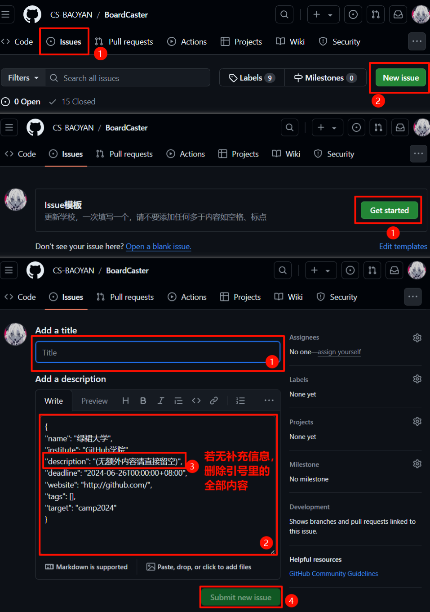

# BoardCaster

BoardCaster 是 CSBAOYAN 相关的数据库，使用JSON文件管理格式化的保研相关信息，并通过 Issue 进行更新以简化参与开源流程的难度。

最后修改日期为：2024-09-04 13:44:35

## 贡献流程

### 对于管理员

close issue 操作请由管理员审核后（是否合规）进行操作，其中重点在于，description 中如留空，是否依然残留'()'内容。请勿同时保持两个 action 同时运行。

### 发布信息

假如说贡献者计划发布新的信息，可以在 Issue 中提交，根据Issue模板的要求即可。无需担心模板填写错误，管理员在进行审核后会修改Issue内容，并通过closed进行更新。

不擅长使用 Github 的贡献者，我们提供了图文教学如下：

一些或许需要注意的内容包括，DDL 采用东八区时间（北京时间），对于某一天截至的 DDL，时间被标记为第二天的零点。Tags 支持自动填写 TOP2/华五/C9/985/211/双非/四非，若填写院校完全符合以上内容，Tags 可留空。

### 修改信息

假如说贡献者计划修改信息，可以通过正常的开源流程进行commit。

假如说JSON文件存在相应的修改，请注意commit格式为 `大学 学院 XX修改`，修改类型包括：

- `link`：链接的更新。
- `OC`：Open Camp，开营Tag的添加
- `CC`：Close Camp，结营Tag的添加
- `TagFix`：Tag的修复与补充
- `DescribeFix`：描述的修复与补充

请注意单次修改对应单次commit。

其他文件的commit不做强制要求，在PR中说明清楚即可。

### 其他

通过正常的开源流程进行commit。

## 更新计划

- [ ] 支持除夏令营以外的更多数据栏目。